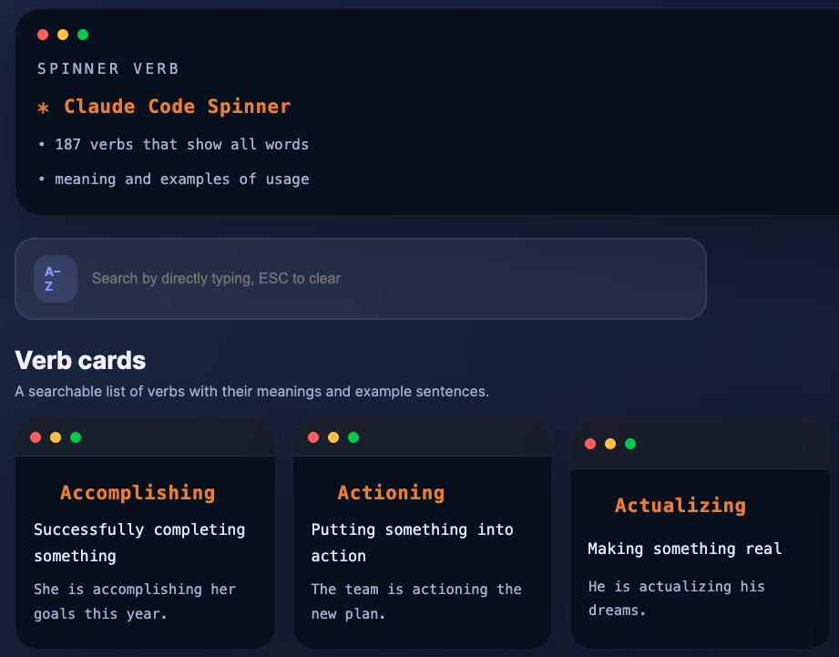

# claude-spinner-verb-cards



A dark terminal-style verb spinner UI with searchable verb cards and animated loader metadata.

## Features

- Search verbs by name, meaning, or example
- Keyboard A–Z filtering support
- Animated terminal-style card headers
- Uses `spinner-text.json` for verb data
- Deployable to GitHub Pages via GitHub Actions

## Files

- `index.html` — main page layout
- `styles.css` — terminal-inspired UI styles
- `script.js` — loads verb data, renders cards, and handles search
- `spinner-text.json` — verb list with meanings and examples
- `.github/workflows/gh-pages.yml` — GitHub Pages deployment workflow

## Run locally

Open the project in a local browser or serve it via HTTP:

```bash
python3 -m http.server 8000
```

Then visit `http://127.0.0.1:8000`.

## Deploy to GitHub Pages

This repository includes a workflow that publishes the site on push to `main`.

1. Push changes to the `main` branch.
2. In GitHub Settings → Pages, set the source to the `gh-pages` branch if needed.
3. The site will deploy automatically.

